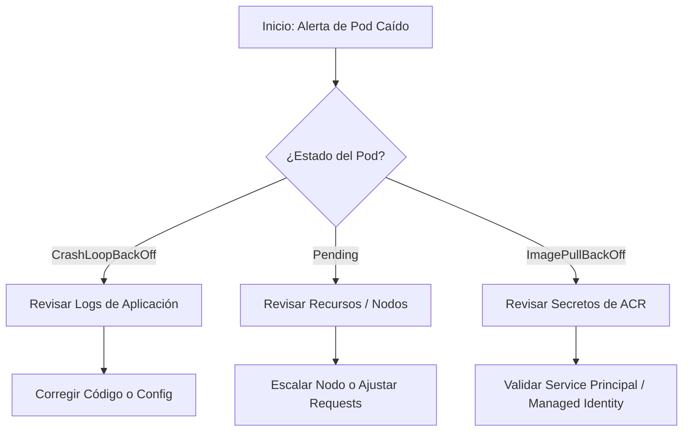

# Guía de Diagnóstico: Resolución de Incidentes en AKS

Esta guía documenta el procedimiento estándar para diagnosticar y mitigar errores en Pods dentro de Azure Kubernetes Service (AKS), basado en incidencias reales de producción.

## 1. Flujo de Diagnóstico Visual



## 2. Comandos de Inspección Rápida

```bash
# Ver el estado detallado del pod (Eventos al final son clave)
kubectl describe pod <nombre-del-pod> -n <namespace>

# Ver logs del contenedor anterior (si crasheó)
kubectl logs <nombre-del-pod> --previous

# Verificar consumo de recursos vs límites
kubectl top pod <nombre-del-pod>
```

## 3. Casos Comunes y Soluciones

### Estado: CrashLoopBackOff

Generalmente indica un error en el código de la aplicación o una mala configuración de variables de entorno.

!!! failure "Causa raíz frecuente en entornos bancarios"
    En entornos restringidos, muchas veces la aplicación falla porque no puede conectar a la Base de Datos (Azure SQL) debido a reglas de Network Security Groups (NSG) o falta de whitelist en el Firewall.

```bash
kubectl exec -it <pod> -- nc -zv <sql-server-url> 1433
```

### Estado: Pending

Indica que el scheduler no encuentra ningún nodo donde ubicar el pod.

!!! warning "Ojo con los Recursos" Si definimos resources.requests muy altos (ej. 4GB RAM) y los nodos son pequeños (Standard_DS2_v2), el pod nunca se agendará.

## 4. Automatización Relacionada

Referencias opcionales a scripts de remediación, Playbooks de Ansible o pipelines de ajuste automático de recursos.
